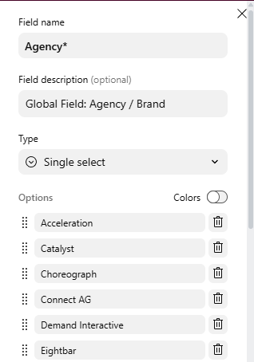
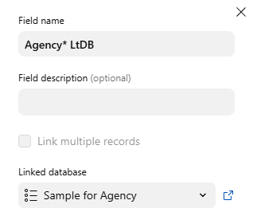
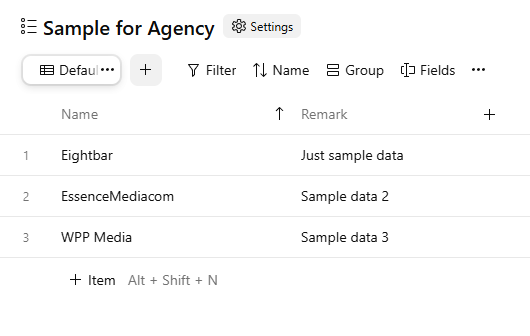
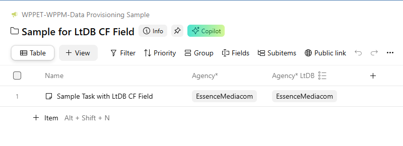
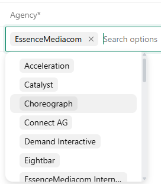
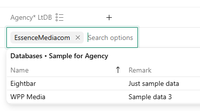

# Technical Advisory: Migration of "Agency*" Custom Field to Datahub

**Target Audience:** Development teams integrating with Wrike API

**Subject:** Change of "Agency*" Custom Field type from Dropdown to Linked to Database

## 1. Overview

This advisory outlines an upcoming technical change regarding the "Agency*" global custom field in Wrike. The field type will be migrated from a standard **Dropdown** list to a **Linked to Database** field powered by Wrike Datahub.

This change will impact how the "Agency*" field is read from and written to via the Wrike API. Integrations relying on this field must be updated to accommodate the new data structure and logic.

**Note:** The specific date for this migration will be communicated separately. Please refer to the WPP ET Wrike team for the schedule.

## 2. Background

Wrike has introduced **Datahub**, a feature allowing the creation of database tables with records natively within Wrike. This enables robust Master Data Management (MDM) directly in the platform, replacing the legacy method of maintaining master data solely as text options within Dropdown custom fields.

The "Agency*" custom field has been identified as a upcoming candidate to make use of this new feature.

### Comparison

*   **Current State:** "Agency*" is a Dropdown Custom Field.



*   **Future State:** "Agency*" will become a Linked to Database Custom Field.



The underlying data will reside in a Datahub Database:



The user experience remains largely consistent for end-users:



## 3. User Experience Impact

*   **Dropdown List (Current):**



*   **Linked to Database (Future):**



## 4. API Integration Impact

The most significant impact is on API operations. The data format for reading and writing to this field will change.

### 4.1. Read Operations

When fetching tasks, the `customFields` array will return different values for the "Agency*" field.

#### Standard Response
Instead of a plain text value (e.g., "EssenceMediacom"), the API will return a JSON array containing the **Record ID** from the Datahub database.

**GET** `https://app-eu.wrike.com/api/v4/tasks/{taskId}`

``` json
{
    "kind": "tasks",
    "data": [
        {
            "id": "MAAAAAEDmqEl",
            "accountId": "IEAC7PRT",
            "title": "Sample Task with LtDB CF Field",
            "customFields": [
                {
                    "id": "IEAC7PRTJUAB43DB",
                    "value": "EssenceMediacom"
                },
                {
                    "id": "IEAC7PRTJUAKMO4U",
                    "value": "[\"RE281474983375797\"]"
                }
            ]
        }
    ]
}
```

#### Read Operation (Transition option), lookupAsSelect option

Wrike product team had introduced a new parameter `lookupAsSelect` to make it possible to have original style with actual text value in the response.

**GET** `https://app-eu.wrike.com/api/v4/tasks/MAAAAAEDmqEl?lookupAsSelect`

Response Snippet (CF)

``` json
{
    "kind": "tasks",
    "data": [
        {
            "id": "MAAAAAEDmqEl",
            "accountId": "IEAC7PRT",
            "title": "Sample Task with LtDB CF Field",
            "description": "",
            "briefDescription": "",
            "parentIds": [
                "MQAAAAEDmqD3"
            ],
            "customFields": [
                {
                    "id": "IEAC7PRTJUAB43DB",
                    "value": "EssenceMediacom"
                },
                {
                    "id": "IEAC7PRTJUAKMO4U",
                    "value": "EssenceMediacom"
                }
            ]
        }
    ]
}
```

#### Write/Update Operation, existing Dropdown List CF

**POST** `https://app-eu.wrike.com/api/v4/tasks/MAAAAAEDmqEl?customFields=[{"id":"IEAC7PRTJUAB43DB","value":"Eightbar"}]`

#### Write/Update Operation, future Linked to Database CF

**POST** `https://app-eu.wrike.com/api/v4/tasks/MAAAAAEDmqEl?customFields=[{"id":"IEAC7PRTJUAKMO4U","value":"[\"RE281474983375798\"]"}]`

Note that the update to the CF requires the Record Id of the corresponding Database record.

To know find out the Record Id, there are a few steps to it:

1. Retrieve the Database Id from Custom Field definition
2. Retrieve the Record Id via Datahub API

##### Retrieve the Database Id from the Custom Field definition

Using the Custom Field Id "IEAC7PRTJUAKMO4U", get the Database Id via:

**GET** `https://app-eu.wrike.com/api/v4/customfields/IEAC7PRTJUAKMO4U`

**Response Snippet**

``` json
{
    "kind": "customfields",
    "data": [
        {
            "id": "IEAC7PRTJUAKMO4U",
            "accountId": "IEAC7PRT",
            "title": "Agency* LtDB",
            "type": "LinkToDatabase",
            "spaceId": "IEAC7PRTI5HB2NPK",
            "sharedIds": [],
            "sharing": {},
            "settings": {
                "inheritanceType": "All",
                "applicableEntityTypes": [
                    "WorkItem"
                ],
                "readOnly": false,
                "allowTime": false,
                "linkToDatabaseInfo": {
                    "dataHubDatabaseId": "DB281474977096236",
                    "allowMultipleEntries": false,
                    "mirrorFields": [
                        {
                            "dataHubFieldId": "FI281474976815763",
                            "customFieldId": "IEAC7PRTJUAKMO5G"
                        }
                    ]
                }
            },
            "description": ""
        }
    ]
}
```

The dataHubDatabaseId is the Id of the Database.

##### Retrieve the Record Id using Database Id via Datahub API

**GET** `https://app-eu.wrike.com/app/wrike_v2_web/public/api/v1/databases/DB281474977096236/records`

**Response Snippet**

``` json
{
    "data": [
        {
            "id": "RE281474983375797",
            "title": "EssenceMediacom",
            "deleted": false,
            "fieldValues": {
                "FIid": "RE281474983375797",
                "FIname": "EssenceMediacom",
                "FIcreatedOn": "2026-01-22T16:29:14.561Z",
                "FIupdatedOn": "2026-01-22T16:49:32.824Z",
                "FIisRecycled": false,
                "FI281474976815763": "Sample data 2"
            }
        },
        {
            "id": "RE281474983375798",
            "title": "Eightbar",
            "deleted": false,
            "fieldValues": {
                "FIid": "RE281474983375798",
                "FIname": "Eightbar",
                "FIcreatedOn": "2026-01-22T16:29:19.864Z",
                "FIupdatedOn": "2026-01-22T16:49:25.235Z",
                "FIisRecycled": false,
                "FI281474976815763": "Just sample data"
            }
        }
    ],
    "total": 3
}
```

The Record Id for Eightbar is "RE281474983375798".
