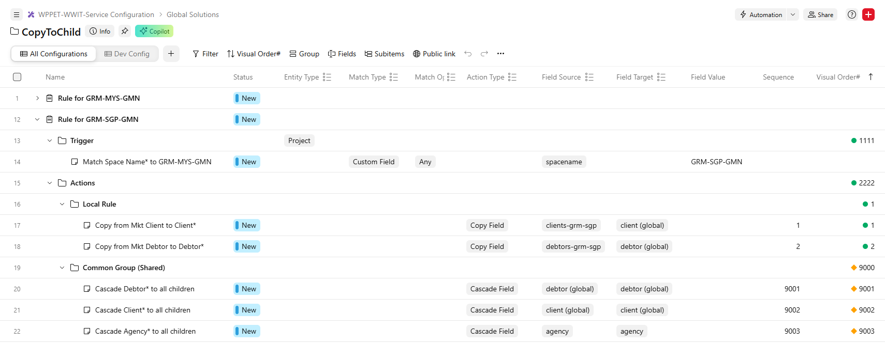

# CopyToChild V2

## Overview

CopyToChild V2 deliver the following functionality over existing V1:

1. Fully configurable on when the CopyToChild rule will trigger.

2. Fully configurable on which fields will be Copied Over or Cascade Down.

## Enhancement Illustration

__Existing CopyToChild V1:__

Fixed to Space Name* as the rule set. (e.g. GRM-SGP-GMN)

Fixed set of fields to copy (e.g. Clients-GRM-SGP to Client*)

Fixed set of fields to Cascade Down (e.g. Client* to Client*)

__Enhanced V2:__

Able to configure for a specific market. (e.g. GRM-MKT-GMN)

Able to configure fields to copy (e.g. Clients-GRM-SGP-Gov to Client*)

Able to configure fields to Cascade Down (e.g. Client* to Client*)

## Configuration in Wrike

The rule configuration is maintained at [WPPET-WWWIT-Service Configuration\Global Solutions\CopyToChild](https://app-eu.wrike.com/open.htm?id=4354057610)

## Creating a new rule for configuration

### Rule

Create a new Project and set the following:

| Custom Field | Value | Remark |
|:-- |:-- |:-- |
| Entity Type | Project | currently only Project is supported |

You may name it meaningfully so that it is easier to maintain.

Create under the new Project:

| Folder Name | Remark |
|:-- |:-- |
| Trigger | Folder to hold triggerring conditions |
| Actions | Folder to hold actions to be taken when the trigger is met |

### Trigger

Create a task under this folder and fill up the following:

| Custom Field | Value | Remark |
|:-- |:-- |:-- |
| Match Type | Custom Field | currently only Custom Field is supported |
| Match Operation | Any/All/None | Any: the value of the field matches any of the values in the Field Value   All: the value of the field matches all of the values in the Field Value   None: the value of the field does not match any of the values in the Field Value |
| Field Source | (select from CF list) | The field that will be used to perform the matching operation for this trigger |
| Field Value | GRM-SGP-GMN | The field value to facilitate the matching operation |

_Note: Only 1 rule is supported currently._

### Actions

Create a tasks under this folder and fill up the following:

| Custom Field | Value | Remark |
|:-- |:-- |:-- |
| Action Type | Copy Field/Cascade Field | Copy Field will copy from a field to another (source to target) on the existing project   Cascade Field will copy the source field of existing project to all children's target field |
| Sequence | 1 | Sequence of the actions, the service will run the rules in sequence. |

_Tips: You may use folders to organize the actions and even use cross tagging to share the actions._

## Testing of Rules

The set of rules in this will kicks in when Campaigns in the Test and Evalution folder.

When you've made changes to the rules, please click the following button to force the service to retrieve the newly updated rules.

<button>Refresh Rules</button>

