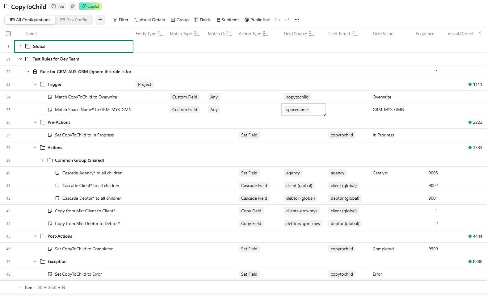

# CopyToChild V2 Documentation

#### Quick Links
- [CopyToChild Configuration](https://app-eu.wrike.com/open.htm?id=4371879499)
- [CopyToChild v2 Test Folder](https://app-eu.wrike.com/workspace.htm?acc=3128883#/folder/4361704918/tableV2?spaceId=4371879306&viewId=440053154)
- [CopyToChild v2 Feedback Form](https://app-eu.wrike.com/workspace.htm#/forms?formid=1534723)

## Overview

**CopyToChild V2** introduces significant flexibility improvements over the legacy V1 implementation. It provides a robust engine for automating field data propagation within Wrike.

Key enhancements include:
1.  **Configurable Triggers:** Define precise conditions for when the CopyToChild rule executes.
2.  **Granular Field Control:** Fully configurable selection of fields for "Copy Over" or "Cascade Down" operations.

## Feature Comparison

| Feature | CopyToChild V1 (Legacy) | CopyToChild V2 (Enhanced) |
| :--- | :--- | :--- |
| **Rule Scope** | Fixed to `Space Name*` (e.g., GRM-SGP-GMN) | Configurable for specific markets (e.g., GRM-MKT-GMN) |
| **Copy Logic** | Fixed set of fields (e.g., `Clients-GRM-SGP` → `Client*`) | Configurable source and target fields (e.g., `Clients-GRM-SGP-Gov` → `Client*`) |
| **Cascade Logic** | Fixed set of fields (e.g., `Client*` → `Client*`) | Configurable source and target fields for cascading |

## Configuration

Rule configurations are managed directly within Wrike.

**Location:** [CopyToChild Configuration](https://app-eu.wrike.com/open.htm?id=4371879499)

## Rule Definition Guide

To define a new configuration rule, follow these steps:

### 1. Create Rule Container
Create a new **Project** to house the rule definition. Give it a descriptive name for easy maintenance.

**Required Custom Fields:**

| Custom Field | Value | Notes |
| :--- | :--- | :--- |
| `Entity Type` | `Project` | Currently, only Project entities are supported. |

**Structure:**
Inside this project, create 5 folders:
*   **`Trigger`**: Contains the conditions that activate the rule.
*   **`Pre-Actions`** Contains the operations to perform after the trigger is met but before any main operations to be performed.
*   **`Actions`**: Contains the main operations to perform when the trigger is met.
*   **`Post-Actions`**: Contains the operations to perform after the Actions section completed.
*   **`Exception`**: Contains the operations to perform if there's any unexpected error during the rule execution.

### 2. Define Triggers
Create a **Task** inside the `Trigger` folder with the following properties:

| Custom Field | Value Options | Description |
| :--- | :--- | :--- |
| `Match Type` | `Custom Field` | The type of matching logic (currently restricted to Custom Field). |
| `Match Operation` | `Any` / `All` / `None` | **Any:** Matches if the field contains *any* of the specified values. **All:** Matches if the field contains *all* specified values. **None:** Matches if the field contains *none* of the specified values. |
| `Field Source` | *(Select from List)* | The Custom Field to evaluate. |
| `Field Value` | e.g., `GRM-SGP-GMN` | The value(s) to match against. |

> *Note: Currently, only single-rule triggers are supported.*

### 3. Define Actions
Create a **Task** inside the `Actions` folder for each operation:

| Custom Field | Value Options | Description |
| :--- | :--- | :--- |
| `Action Type` | `Copy Field` / `Cascade Field` / `Cascade Field (New Only)` | **Copy Field:** Copies data from a source field to a target field on the *same* entity. **Cascade Field:** Propagates data from a source field on the parent to a target field on all *children*.  **Cascade Field (New Only):** Propagates data from a source field on the parent to a target field on all *children* only if it is first time propagation. |
| `Sequence` | `1`, `2`, ... | Determines the execution order of actions. |

> *Tip: Use folders to organize actions or cross-tagging to share common action definitions across rules.*

### 4. Define Pre-Actions, Post-Actions and Exception

The `Pre-Actions`, `Post-Actions` and `Exception` sections are optional, and are maintained the same way as the `Actions` section, just that they will be triggered at different stages or condition in the exeuction pipeline.

## Testing & Validation

### Test Environment
Rules configured here are active for Campaigns located in the [**CopyToChild v2 Test**](https://app-eu.wrike.com/workspace.htm?acc=3128883#/folder/4361704918/tableV2?spaceId=4371879306&viewId=440053154) folder.

### Sync Configuration
After modifying rules in Wrike, you must force the service to reload the configuration:

 
<button style="background-color: #08cf65; border: none; color: white; padding: 12px 24px; text-align: center; text-decoration: none; display: inline-block; font-size: 16px; font-weight: bold; margin: 4px 2px; cursor: pointer; border-radius: 6px; box-shadow: 0 2px 4px rgba(0,0,0,0.1); transition: background-color 0.3s;" onclick="const d=document.createElement('div');d.style.cssText='position:fixed;top:0;left:0;width:100%;height:100%;background:rgba(0,0,0,0.5);z-index:9999;display:flex;align-items:center;justify-content:center';const m=document.createElement('div');m.style.cssText='background:white;padding:20px;border-radius:8px;box-shadow:0 2px 10px rgba(0,0,0,0.1);font-family:sans-serif;font-size:16px;color:#333';m.innerText='Refreshing Rules';d.appendChild(m);document.body.appendChild(d);fetch('https://732aaf571ac5ec828cbdb4633eecaf.aa.environment.api.powerplatform.com:443/powerautomate/automations/direct/workflows/f2b262a6f92f4cebaa3e3a420c0acef7/triggers/manual/paths/invoke?api-version=1&sp=%2Ftriggers%2Fmanual%2Frun&sv=1.0&sig=giZUkbMX5CjxBbPXAx_6mvjEuuoh8YftnNHUXspp01A',{method:'PUT'}).then(r=>{m.innerText=r.ok?'Rules refreshed successfully.':'Something went wrong, please try again later.';setTimeout(()=>document.body.removeChild(d),2000)}).catch(e=>{m.innerText='Something went wrong, please try again later.';setTimeout(()=>document.body.removeChild(d),2000)})">🔄 Refresh Rules</button>
  

### Testing Steps

1.  **Duplicate** an existing Campaign (with all CFs but not assignee).
2.  **Move** it to the Test Folder.
3.  **Verify** the results.

> **⚠️ Important:** Ensure the test campaign **does not** reside (or is not cross-tagged) in any existing market spaces. Doing so will trigger the legacy CopyToChild V1 logic, interfering with V2 testing.

### Feedback and Suggestion

Please be generious to provide your feedback and suggestions [**here**](https://app-eu.wrike.com/workspace.htm#/forms?formid=1534723).
